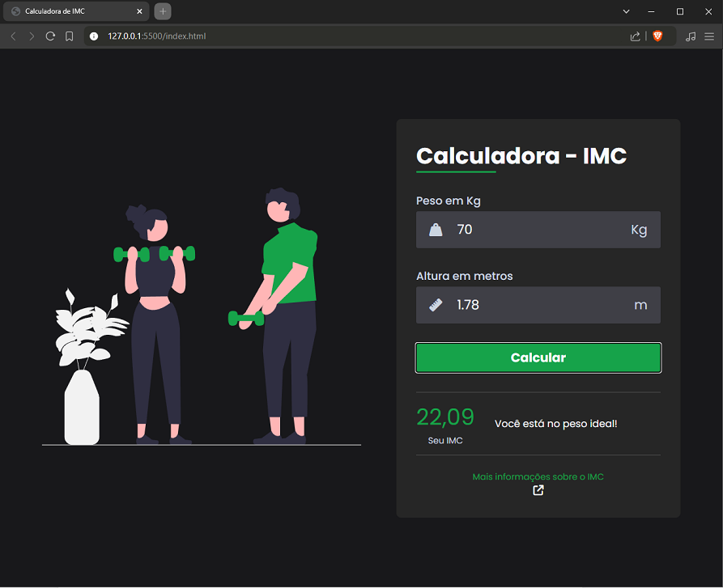

<h1 align="center" style="font-weight: bold;">Calculadora IMC 💻</h1>

    <b>Calculadora de IMC (Índice de Massa Corporal) que avalia se a pessoa está dentro do seu peso ideal, de acordo com a altura.</b>

<h2 id="layout">🎨 Layout</h2>

    

<h2 id="technologies">💻 Tecnologias</h2>

- HTML
- CSS
- Javascript

<h2 id="started">🚀 Objetivo</h2>

O principal objetivo deste projeto foi praticar a manipulação da DOM utilizando JavaScript.

## 📫 Como Me Encontrar:

LinkedIn: [Bruna Themoteo](https://www.linkedin.com/in/brunathemoteo/)

Email: dev.brunathemoteo@gmail.com
